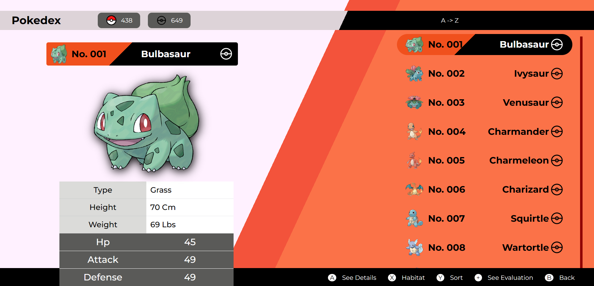

# PokeAPI 03
This design is inspired by this [video](https://youtu.be/E-T5R_GhT-k), which belongs to [TA Coding](https://www.youtube.com/@tacoding).

## Technologies
This web page was made with the following technologies:
- HTML5
- CSS3
- JavaScript
- React (useState, useEffect)
- PokeAPI

## Pages
This web page contains 2 sections: **Home** and **Details**.

### Home
#### In this section you will see a list of 649 pokemon, and if you hover over one of them, more information about that pokemon will appear on the left side.

### Details
#### In this section you will be able to see the details of the pokemon you chose in the previous section, by clicking on one of them. You can see the details of that pokemon in a personalized way.

